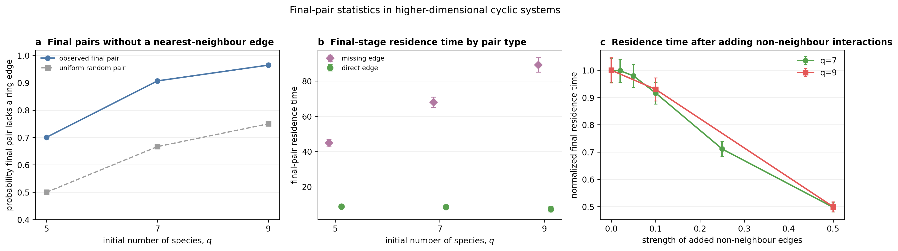

# Final-pair statistics in higher-dimensional cyclic systems

This repository contains simulation code, processed outputs, and the main figure for a numerical study of extinction sequences in cyclic populations with a switching carrying capacity.

## Main observation

Exact event-driven simulations were run for weighted nearest-neighbour cycles with `q = 5, 7, 9`. The probability that the final two surviving species have no direct ring edge was approximately `0.70`, `0.91`, and `0.96`, respectively. For uniformly sampled pairs, the corresponding probabilities are `0.50`, `0.67`, and `0.75`.

Final pairs without a ring edge also had longer mean residence times (`45`, `68`, and `89`) than final pairs with a ring edge (`7` to `9`). Adding interactions between previously unconnected species progressively reduced this final-stage residence time.

The three comparisons are summarized in the main figure:



## Repository contents

- `code/fast_switching_sim.mjs` runs the exact event-driven stochastic simulation.
- `code/plot_fragmentation_core.py` regenerates the main figure and summary statistics.
- `code/validate_independent_implementations.py` recomputes the cross-implementation homogeneity tests.
- `data/` contains the processed trajectory outputs, configurations, seeds, and numerical summaries.
- `figures/fragmentation_core_result.pdf` is the vector version of the main figure.
- `figures/fragmentation_core_result.png` is the browser-preview version.

## Model

For species `i`, the birth and density-dependent death rates are

```text
T_i^+ = n_i [1 + s (A x)_i],
T_i^- = n_i M / K(t),
```

where `M` is the total population, `x_i = n_i/M`, and `A` is a weighted antisymmetric nearest-neighbour cycle. The carrying capacity switches dichotomously between `K(1-delta)` and `K(1+delta)`. Each trajectory begins at the positive interior equilibrium and is followed until one species remains.

For every trajectory, the simulator records the complete extinction order, all extinction times, residence times at each surviving-species count, the final pair, and its interaction magnitude.

## Baseline design

- odd dimensions `q = 5, 7, 9`;
- selection strength `s = 0.5`;
- switching amplitude `delta = 0.7`;
- switching rate `nu = 20`;
- effective population per initial species `K_eff/q = 20`;
- independently seeded trajectories;
- `4000`, `2500`, and `2000` trajectories for `q = 5, 7, 9`.

Each JSON output includes its full configuration, derived parameters, equilibrium composition, trajectory count, timing summaries, and random seed.

## Reproduce the main figure

Python requirements are listed in `requirements.txt` (`numpy`, `scipy`, and `matplotlib`). From the repository root, run:

```bash
python code/plot_fragmentation_core.py
```

The script reads the stored JSON outputs in `data/`, writes the figure to `figures/`, and updates `data/fragmentation_core_summary.json`.

## Run a representative simulation

Node.js 18 or later is recommended.

```bash
node code/fast_switching_sim.mjs \
  --q 7 \
  --trials 2500 \
  --k-mean 275 \
  --delta-k 0.7 \
  --s 0.5 \
  --nu 20 \
  --heterogeneity 0.55 \
  --phase 0 \
  --full-fixation true \
  --topology ring \
  --design switching \
  --seed 20261023 \
  --output data/example_q7.json
```

To add interactions between previously unconnected pairs, replace `--topology ring` with `--topology leaky_ring` and specify their strength, for example `--leakage 0.25`.

## Numerical checks

The separation between final pairs with and without a ring edge was also evaluated at `q = 7` with switching amplitude `delta = 0.5` and switching rate `nu = 40`. The results are stored in `data/robustness_summary.json`.

The optimized Node simulator was compared with a separately written NumPy implementation in a three-species benchmark. To recompute the homogeneity tests from the stored outputs, run:

```bash
python code/validate_independent_implementations.py
```

The resulting statistics are stored in `data/independent_implementation_validation.json`.

## Author

Ruocun Ou  
Nanyang Normal University  
ouruocun@gmail.com

## License

MIT
